# RAG Research Assistant: Backend Flow Documentation

This document explains the backend flow of the system: which API endpoints are called, which internal functions/modules are triggered, and how data moves through the pipeline. Each endpoint is described with both stepwise arrows and a Mermaid diagram for clarity.

---

## 1. Document Upload Endpoint

**Flow:**
Client uploads PDF(s) -> `/upload` (FastAPI) -> `pdfplumber`/`PyPDF2` -> `langchain` chunking -> Embedding via Ollama -> Store in `chromadb` vector store -> Update BM25 index

**Stepwise:**
Client -> `/upload` -> PDF Parser -> Text Chunker -> Embedding Model -> Vector Store -> BM25 Index

**Mermaid:**
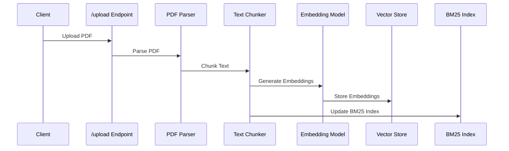

---

## 2. Search Endpoint (Hybrid Retrieval)

**Flow:**
Client submits query -> `/search` (FastAPI) -> `cache.py` (frequent_query_cache) check -> Dense retrieval (`chromadb` vector store) -> Sparse retrieval (`BM25Index` in `sparse_retrieval.py`) -> Combine scores -> Rerank (cross-encoder) -> Return results

**Stepwise:**
Client -> `/search` -> Cache Check -> Dense Retrieval -> Sparse Retrieval -> Hybrid Combiner -> Cross-Encoder Rerank -> Response

**Mermaid:**
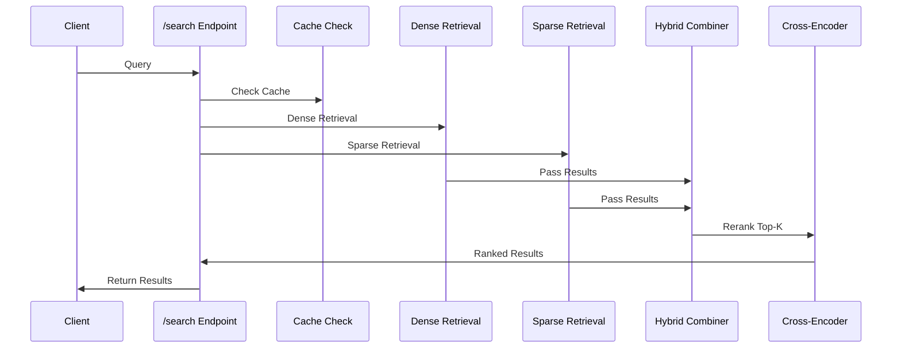

---

## 3. Web Search Endpoint

**Flow:**
Client requests web search -> `/web_search` (FastAPI) -> `web_search.py:search_web` -> Serper API -> Clean/strip HTML -> Summarize (`summarize_results`) -> Return summary/results

**Stepwise:**
Client -> `/web_search` -> `search_web` -> Serper API -> Clean HTML -> Summarize -> Response

**Mermaid:**
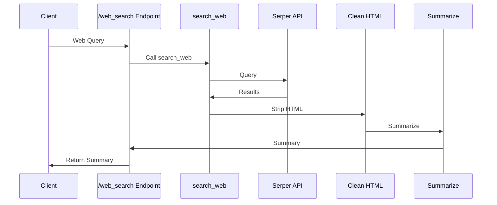

---

## 4. Citation Generation Endpoint

**Flow:**
Client requests citation -> `/citation` (FastAPI) -> `citation.py:generate_citation` -> Format citation -> Return

**Stepwise:**
Client -> `/citation` -> `generate_citation` -> Format -> Response

**Mermaid:**
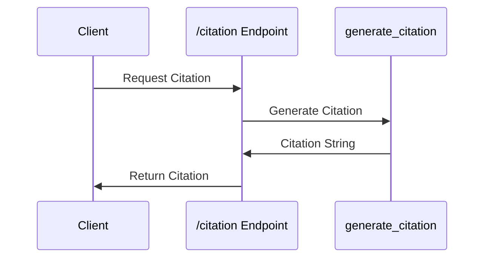

---

## 5. Response Synthesis Endpoint

**Flow:**
Client submits query -> `/synthesize` (FastAPI) -> `response_synthesis.py:synthesize_response` -> Aggregate sources -> Rerank/conflict resolution -> Assess confidence/quality -> Return answer

**Stepwise:**
Client -> `/synthesize` -> `synthesize_response` -> Aggregate -> Rerank -> Assess -> Response

**Mermaid:**
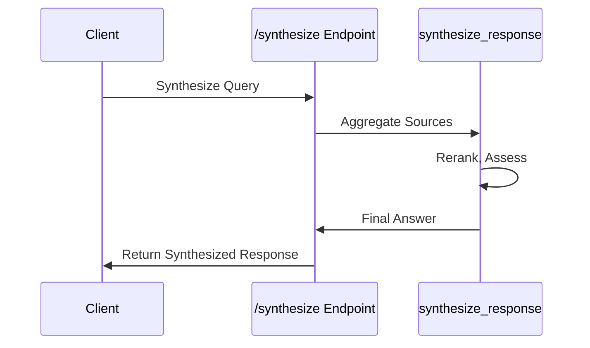

---

## 6. Caching Layer

- All endpoints may interact with `cache.py` for frequent query and response caching.
- Cache is checked before heavy computation and updated after response.

---

**Note:**
- Arrows (->) show the stepwise flow.
- Mermaid diagrams visualize the same process for each endpoint.
- Internal function calls (e.g., `search_web`, `generate_citation`, `synthesize_response`) are shown for clarity.

---

## 7. Document Deletion Endpoint

**Flow:**
Client requests to delete a document by ID -> `/documents/{doc_id}` (FastAPI) -> `vector_store.py:delete_document` -> Remove from `chromadb` -> Update BM25 index

**Stepwise:**
Client -> `/documents/{doc_id}` -> Vector Store -> BM25 Index -> Response

**Mermaid:**
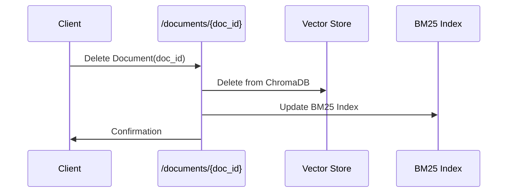

---

## 8. Session Management Endpoints

### Create Session
**Flow:**
Client requests to create a new session -> `/sessions/create` (FastAPI) -> Generate new user ID -> Return user ID

**Mermaid:**
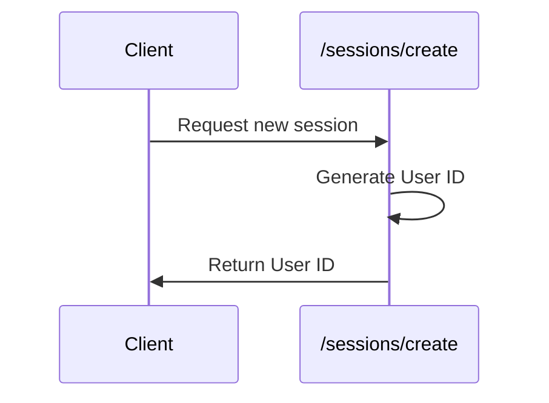

### Get/Update History
**Flow:**
Client requests history or adds a new entry -> `/sessions/{user_id}/history` (FastAPI) -> Interact with session store -> Return history or confirmation

**Mermaid:**
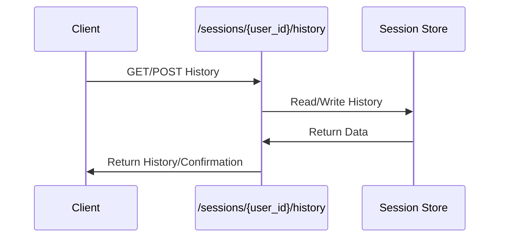

---

## 9. Feedback & Analytics Endpoints

### Submit Feedback
**Flow:**
Client submits a rating for a response -> `/feedback/rating` (FastAPI) -> Store feedback data -> Use for quality monitoring

**Mermaid:**
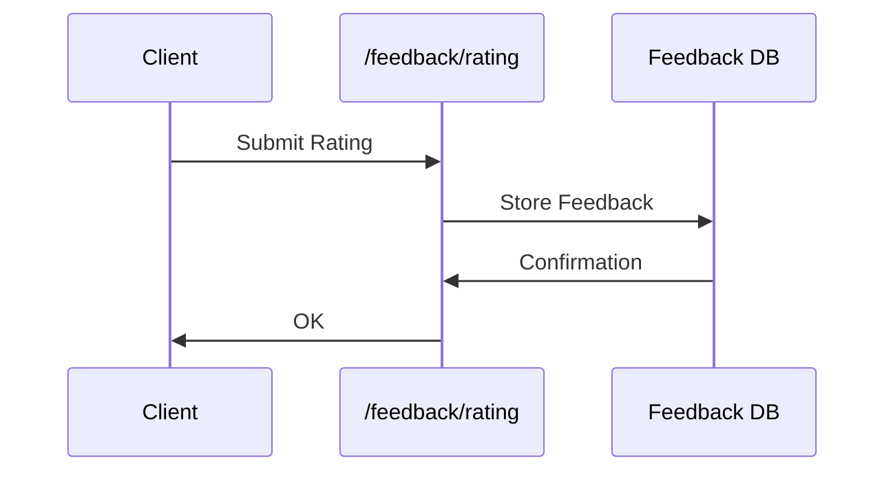

### Get Analytics
**Flow:**
Admin/Client requests query analytics -> `/analytics/queries` (FastAPI) -> Fetch data from analytics store -> Return analytics data

**Mermaid:**
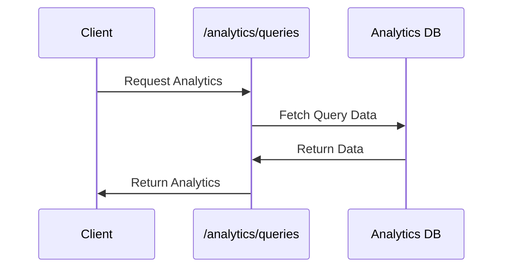

---

## 10. Utility Endpoints

### Clear Cache
**Flow:**
Client requests to clear cache -> `/cache/clear` (FastAPI) -> `cache.py:clear_all_caches` -> Return confirmation

**Mermaid:**
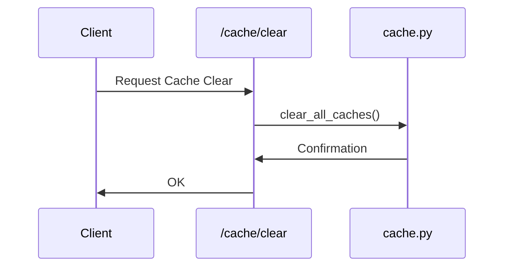

### Health Check
**Flow:**
System monitor requests health check -> `/health` (FastAPI) -> Check service status -> Return "OK"

**Mermaid:**
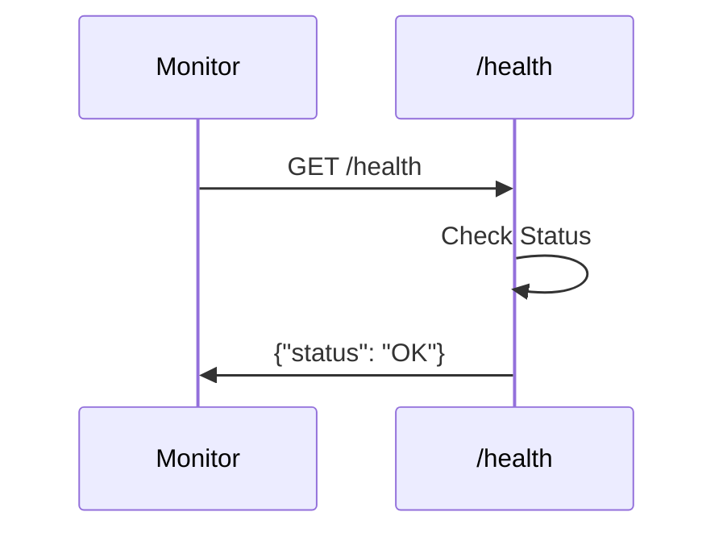
